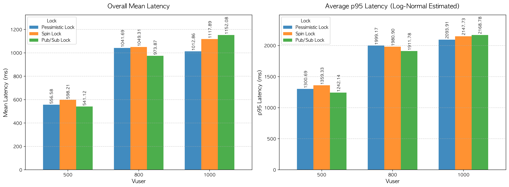

# 응답 지연 시간(Latency) 및 p95 분석 보고서

본 문서는 동시성 제어(Concurrency Control) 방식(Pessimistic Lock, Spin Lock, Pub/Sub Lock)에 따른 응답 지연 시간(Mean Latency)과 꼬리 지연 시간(p95 Tail Latency)을 분석한 결과입니다. 본 데이터는 앞서 진행된 `TPS 분석 보고서`와 교차 검증하여 작성되었습니다.

---

## 1. 종합 지표 요약

|         Lock         | Vuser | Worst Mean Latency | Overall Mean Latency | Best Mean Latency | p95 Tail Latency |
| :------------------: | :---: | :----------------: | :------------------: | :---------------: | :--------------: |
| **Pessimistic Lock** |  500  |       732.61       |        556.58        |      409.65       |     1300.69      |
|                      |  800  |      1303.32       |       1041.69        |      828.86       |     1999.17      |
|                      | 1000  |      1124.91       |       1012.86        |      764.98       |     2093.91      |
|    **Spin Lock**     |  500  |       712.17       |        598.21        |      388.85       |     1359.33      |
|                      |  800  |      1197.05       |       1049.31        |      846.03       |      1980.9      |
|                      | 1000  |      1234.61       |       1117.89        |      911.19       |     2147.73      |
|   **Pub/Sub Lock**   |  500  |       814.15       |        541.12        |       332.8       |     1242.14      |
|                      |  800  |      1140.96       |        973.87        |      759.43       |     1911.78      |
|                      | 1000  |      1490.58       |       1152.08        |      1027.28      |     2168.78      |

---

## 2. Lock 별 성능 분석

### Pessimistic Lock

- **응답 속도:** Vuser 800(1041.69 ms)에서 Vuser 1000(1012.86 ms)으로 부하가 증가했음에도 평균 지연 시간이 오히려 소폭 감소하거나 정체하는 기현상이 나타남.
- **원인 분석(시스템 파이프라인 포화 현상):**
  - 실제 로그 확인 결과 Timeout Error 비율은 극히 미미했으므로, 에러 발생으로 인한 생존자 편향(Survivor Bias)은 아님.
  - Vuser 800 이상부터 평균 지연 시간이 정체된 것은 **애플리케이션의 Tomcat 스레드 풀(Max 200) 및 DB 커넥션 풀(Max 150)이 동시에 수용할 수 있는 동시성 임계점에 도달**했기 때문임.
- **대기열 이론(Queueing Theory) 적용 심층 분석:**
  - Vuser 800이든 1000이든 시스템 내부에서 실제로 DB Lock을 두고 경합하는 스레드의 수는 최대 150개(DB 커넥션 한계)로 동일함.
  - **컨텍스트 스위칭 오버헤드:** 제한된 CPU 자원(컨테이너당 2 Core)이 150개의 DB 커넥션(스레드)을 번갈아 가며 처리하느라 상태를 저장하고 불러오는 작업에 자원을 크게 낭비하게 되어, 실제 쿼리 처리 효율이 극도로 저하됨.
  - 현재 애플리케이션의 설정상 수용 가능한 **물리적 최대 대기/처리 한계선은 총 700개**임. (Tomcat 스레드 `threads.max` 200개 + 대기열 큐 `accept-count` 500개)
  - Vuser 800에서 1000으로 외부 부하가 늘어나도, 서버 내부의 대기열은 이미 최대치(700개)에 도달해 테스트 내내 100% 포화 상태를 유지함.
  - **평균 지연 시간의 정체 원리:** 1041.69 ms는 700명 규모의 포화된 파이프라인을 거쳐 간 **모든 요청의 평균(Mean) 대기 시간**임. 따라서 테스트를 진행하는 요청들의 평균 대기 시간 역시 물리적 한계점(약 1000 ms 부근)으로 고정된 것임. (1041 ms와 1012 ms의 미세한 차이는 통계적 오차로 간주)
  - 다중 WAS 환경(WAS 2대)에서 총 300개의 커넥션이 MySQL의 단일 레코드(`courseId: 1`)를 갱신하기 위해 경합하면서 발생하는 '핫 로우 경합'이 근본적인 병목 원인으로 지목됨.

### Spin Lock

- **응답 속도:** Vuser 500 구간(598.21 ms)에서 다른 두 락 방식 대비 가장 느린 평균 응답 시간 기록
- **p95 꼬리 지연 시간 분석:** 부하가 증가할수록 p95 지연 시간이 1359.33 ms → 1980.90 ms → 2147.73 ms로 가파르게 상승
- **원인 분석:**
  - 락을 획득하기 위해 스레드가 쉴 새 없이 상태를 확인하는 구조 탓에 CPU 점유율과 경함 심화됨
  - 제한된 CPU 자원(컨테이너당 2 Core) 환경에서 부하가 가중될수록 잦은 컨텍스트 스위칭 오버헤드가 발생하며, 락을 늦게 획득하는 스레드들의 대기 시간이 기하급수적으로 늘어나 응답 시간의 편차가 크게 벌어지는 약점을 보임.

### Pub/Sub Lock

- **응답 속도:** 저부하(Vuser 500) 및 중부하(Vuser 800) 상황에서 전체 평균 지연 시간이 각각 541.12 ms, 973.87 ms로 **가장 빠르고 안정적인 응답 속도** 보임
- **고부하(Vuser 1000) 현상:** Vuser 1000에서는 평균 지연 시간(1152.08 ms)과 p95(2168.78 ms)가 3가지 방식 중 가장 높게 측정됨.
- **원인 분석:**
  - 다른 락들은 DB 자원 병목으로 인해 한계 처리량(TPS)이 정체된 반면, Pub/Sub Lock은 인메모리를 활용한 효율적인 이벤트 대기 방식을 통해 병목 없이 **가장 많은 요청을 성공적으로 소화(최고 TPS 기록)했기 때문**임.
  - 끝까지 큐에서 대기하여 가장 많은 사람에게 응답을 주었으므로, 필연적으로 대기열 후미에 있던 요청들의 긴 대기 시간이 통계에 반영되어 Latency가 가장 길게 측정됨.
  - 즉, 시스템이 병목에 빠지지 않고 유연하게 확장하고 있다고 볼 수 있음.

---

## 3. 결론 및 인사이트

1. **DB 락의 스케일 아웃 한계 증명:** 다중 WAS 및 로드밸런서 환경에서 단일 레코드에 대한 `Pessimistic Lock` 제어 방식은 트래픽 폭증 시 DB 커넥션 풀을 과점유하여 전체 시스템의 파이프라인을 마비시킴.
2. **분산 락의 우수성 확인:** 인메모리 기반의 `Pub/Sub Lock`은 극한의 핫 로우 경합 상황에서도 DB에 직접적인 부하를 주지 않고 WAS 단에서 이벤트를 대기하므로, 시스템 다운이나 병목 현상 없이 가장 안정적이고 높은 확장성을 보여줌.
3. **한계점 및 향후 과제:** 본 테스트의 Vuser 800, 1000 구간에서 지연 시간이 역전되거나 정체된 현상은 시스템 물리적 수용 한계 도달에 의한 것으로 확인됨. 추후 더 극단적인 부하 한계를 확인하기 위해서는 WAS의 CPU 할당량과 Tomcat 대기열 확장을 고려해 볼 수 있으나, 현재의 설정이 한정된 자원 내에서의 알고리즘 성능 비교 목적에는 가장 적합한 환경임을 확인함.
