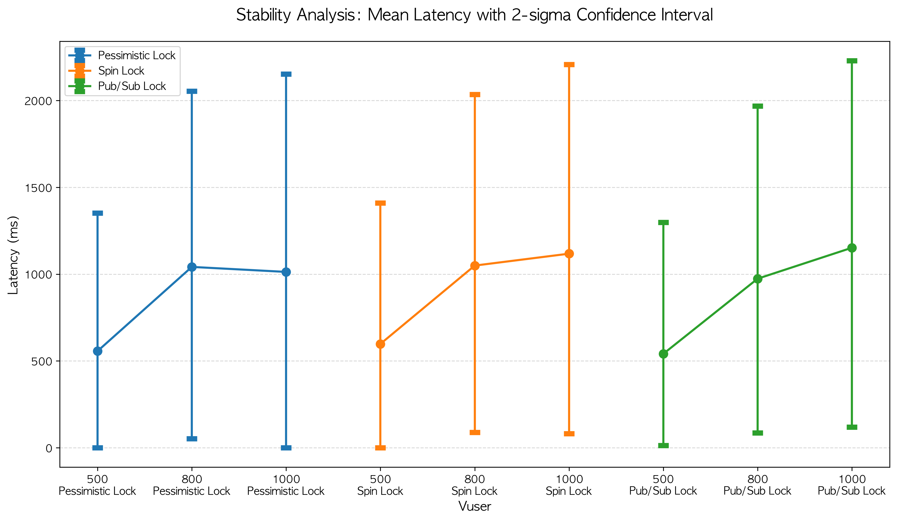

# 시스템 안정성(Stability) 및 2-Sigma 신뢰 구간 분석 보고서

본 문서는 동시성 제어(Concurrency Control) 방식에 따른 응답 지연 시간의 표준편차(Standard Deviation)와 2-Sigma(약 95.4%) 신뢰 구간을 분석하여, 시스템의 **예측 가능성(Predictability)**과 **안정성(Stability)**을 평가한 결과입니다.

---

## 1. 종합 지표 요약

|         Lock         | Vuser | Overall Mean Latency | Avg Total Sigma | Avg Lower Bound | Avg Upper Bound |
| :------------------: | :---: | :------------------: | :-------------: | :-------------: | :-------------: |
| **Pessimistic Lock** |  500  |        556.58        |     398.01      |       0.0       |     1352.6      |
|                      |  800  |       1041.69        |     506.06      |      52.54      |     2053.82     |
|                      | 1000  |       1012.86        |     570.22      |       0.0       |     2153.29     |
|    **Spin Lock**     |  500  |        598.21        |     405.68      |       0.0       |     1409.57     |
|                      |  800  |       1049.31        |     493.24      |      88.64      |     2035.79     |
|                      | 1000  |       1117.89        |     544.91      |      81.46      |     2207.72     |
|   **Pub/Sub Lock**   |  500  |        541.12        |      378.7      |      12.53      |     1298.53     |
|                      |  800  |        973.87        |      497.0      |      86.32      |     1967.88     |
|                      | 1000  |       1152.08        |     539.01      |     119.05      |     2230.1      |

---

## 2. Lock 별 안정성 분석

### Pessimistic Lock

- **변동성 폭증:** Vuser 800에서 1000으로 넘어갈 때 평균 지연 시간은 감소/정체(1041.69 ms → 1012.86 ms)했으나, **표준편차는 오히려 506.06에서 570.22로 세 방식 중 가장 높게 폭증**함.
- **원인 분석;**
  - 이는 시스템 파이프라인이 100% 포화된 상태에서 발생하는 극심한 **지터(Jitter, 지연 시간의 불규칙한 변동)** 현상임.
  - DB 커넥션 150개가 락을 획득하기 위해 무한 경쟁을 벌이면서, 어떤 요청은 운 좋게 빨리 처리되고 어떤 요청은 타임아웃 직전까지 대기하는 등 **응답 시간의 예측 불가능성이 극에 달한 상태**임 의미

### Spin Lock

- **불안정한 대기열:** 모든 Vuser 구간에서 높은 표준편차를 보여주며 넓은 2-Sigma 상한선을 기록했습니다.
- **원인 분석:**
  - 스레드가 락 상태를 끊임없이 확인하는 구조이므로, 대기 중인 스레드들 사이에 공정한 순서가 보장되지 않음.
  - CPU 스케줄링에 따라 운 나쁜 스레드는 계속해서 락 획득에 실패하며 대기 시간이 길어지는 기아 현상(Starvation)의 조짐이 나타나 분산이 커진 것으로 해석됨.

### Pub/Sub Lock

- **최고의 안정성:** 모든 구간(Vuser 500, 800, 1000)에서 **가장 낮은 표준편차(Sigma)와 가장 타이트한 2-Sigma 상한선** 기록
- **원인 분석:**
  - Redis의 Pub/Sub을 활용한 이벤트 구동(Event-driven) 방식은 스레드를 무의미하게 깨우지 않고 큐를 통해 순차적이고 질서 있게 락 배분.
  - 고부하(Vuser 1000) 상황에서 전체 대기열이 길어짐에 따라 평균 지연 시간 자체는 증가했으나, 유저들 간의 대기 시간 편차가 가장 적어 **느려지더라도 모두가 공평하고 예측 가능한 수준으로 느려지는** 가장 안정적이고 신뢰도 높은 아키텍처임을 증명함.

---

## 3. 결론 및 인사이트

1. **지연 시간의 함정(Jitter):** 평균 지연 시간이 짧거나 정체되었다고 해서 성능이 좋은 것이 아님을 `Pessimistic Lock`의 Vuser 1000 데이터가 보여줌. 평균은 1012.86 ms로 낮아 보이지만, 표준편차가 570.22에 달해 2-Sigma 상한선이 2153.29 ms까지 치솟음. 이는 서비스 제공자 입장에서 SLA(Service Level Agreement, 서비스 품질 보장)를 지키기 가장 까다로운 통제 불능의 상태임.
2. **이벤트 기반 대기의 공정성:** `Pub/Sub Lock`은 극한의 핫 로우 경합 상황에서도 가장 낮은 표준편차 유지함. 분산 서버버(다중 WAS) 환경에서 대규모 트래픽이 몰릴 경우, 풀링(Spin)이나 스레드 블로킹 방식보다 중앙 집중형 인메모리 이벤트 브로커(Redis Pub/Sub)에 순서를 위임하는 것이 시스템 전ㅊ의 안정성과 응답 예측성을 극대화하는 최적의 설계임.
