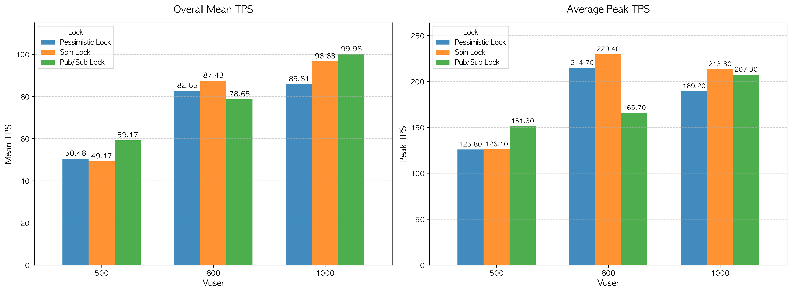

# TPS(Transactions Per Second) 성능 분석 보고서

본 문서는 동시성 제어(Concurrency Control) 방식(Pessimistic Lock, Spin Lock, Pub/Sub Lock)에 따른 시스템의 초당 트랜잭션 처리량(TPS)을 비교 및 분석한 결과입니다. 테스트는 각 락 방식과 가상 사용자(Vuser) 수(500, 800, 1000)에 따라 각각 5회씩 진행되었습니다.

---

## 1. 종합 지표 요약

|         Lock         | Vuser | Worst Mean TPS | Overall Mean TPS | Best Mean TPS | Average_Peak_TPS |
| :------------------: | :---: | :------------: | :--------------: | :-----------: | :--------------: |
| **Pessimistic Lock** |  500  |     35.71      |      50.48       |     62.5      |      125.8       |
|                      |  800  |     66.58      |      82.65       |     100.0     |      214.7       |
|                      | 1000  |      62.5      |      85.81       |     100.0     |      189.2       |
|    **Spin Lock**     |  500  |     41.67      |      49.17       |     62.5      |      126.1       |
|                      |  800  |     57.14      |      87.43       |     100.0     |      229.4       |
|                      | 1000  |     83.33      |      96.63       |     100.0     |      213.3       |
|   **Pub/Sub Lock**   |  500  |      50.0      |      59.17       |     83.33     |      151.3       |
|                      |  800  |     66.67      |      78.65       |     100.0     |      165.7       |
|                      | 1000  |     83.25      |      99.98       |     125.0     |      207.3       |

---

## 2. Lock 별 성능 분석

### Pessimistic Lock

- **성능 추이:** Vuser 500(50.48 req/s)에서 800(82.65 req/s)으로 증가할 때 성능이 대폭 상승했으나, Vuser 1000(85.81 req/s)에서는 상승폭이 미미하여 처리량 한계(병목 현상)에 도달하기 시작한 것으로 보임.
- **최대 처리량(Peak):** Vuser 800일 때 Peak TPS(214.7 req/s)가 가장 높게 치솟았으나, Vuser 1000 구간에서는 오히려 189.2 req/s로 하락. 동시성 경합이 심해지며 성능 저하가 발생한 것을 알 수 있음.

### Spin Lock

- **성능 추이:** Vuser 500(49.17 res/s)에서는 세 방식 중 가장 낮은 성능을 보였으나, Vuser 800(87.43 req/s)과 Vuser 100(96.63 req/s)으로 부하가 증가함에 따라 꾸준히 좋은 성능 유지하며 Pessimistic Lock을 추월함.
- **최대 처리량(Peak):** Vuser 800에서 Peak TPS 229.4 req/s를 기록하여 순간적인 요청 처리 능력이 가장 뛰어남. 다만 Vuser 1000에서는 213.3 req/s으로 소폭 감소함.

### Pub/Sub Lock

- **성능 추이:** 저부하(Vuser 500) 상황에서 전체 평균 59.17 req/s로 가장 우수했으며, 고부하(Vuser 100)상황에서도 전체 평균 99.98 req/s로 **최고의 평균 처리량** 기록함.
- **안정성:** Peak TPS가 Vuser가 증가함에 따라 하락하지 않고 꾸준히 증가(151.3 req/s → 165.7 req/s → 207.3 req/s)하는 유일한 모델. 시스템에 부하가 가중되어도 일관된 확장성 보여줌.

---

## 3. 결론 및 인사이트

1. **최고의 스케일업 성능:** `Pub/Sub Lock` 방식이 저부하(Vuser 500)와 고부하(Vuser 1000) 모든 상황에서 가장 안정적이고 높은 평균 TPS(99.98 req/s)를 보여줌. 특히, 경합이 심해질수록 트래픽을 감당하는 확장성이 가장 뛰어남.
2. **트래픽 몰림 시 한계점:** `Pessimistic Lock`과 `Spin Lock`은 Vuser 800 구간에서 순간적인 Peak 성능은 높았으나, Vuser 100으로 부하가 심해지면 Peak TPS가 오히려 꺾이는 현상이 발생함. 이는 스레드 경합 및 블로킹 오버헤드가 한계치에 다다랐음 의미.
3. **권장 아키텍처:** 높은 동시성이 요구되는 대규모 트래픽 환경(Vuser 1000 이상)에서는 확장성과 성능이 보장된 `Pub/Sub Lock` 기반의 동시성 제어 방식을 채택하는 것이 가장 효율적임.
